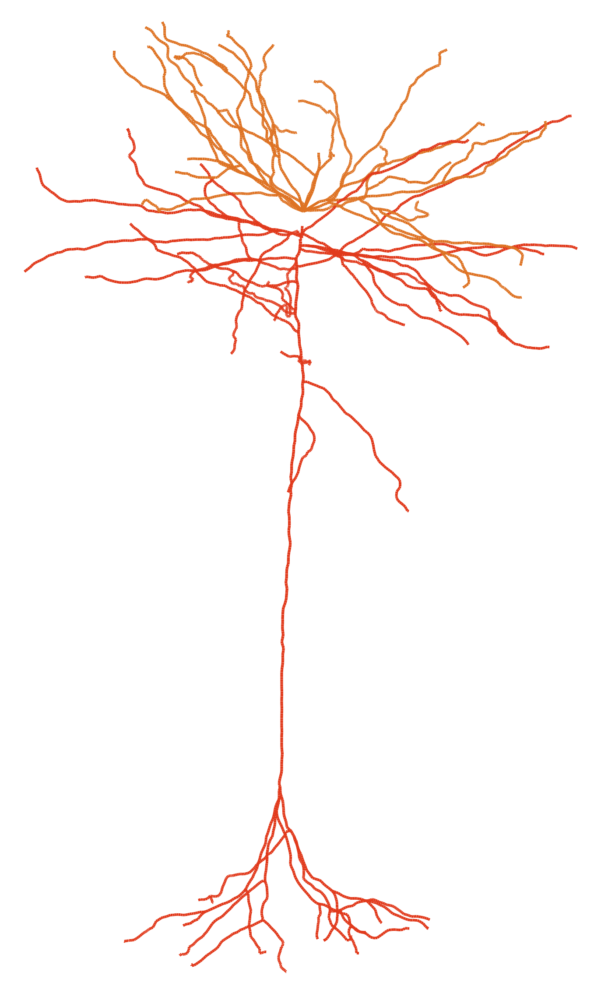

# Skeletons

### This folder include high res SVG files

### Basic naming convention:

- **Cell Type**: The cell type classification of the neuron, e.g.: 5P-ET
- **Root ID**: A unique identifier for the cell root

